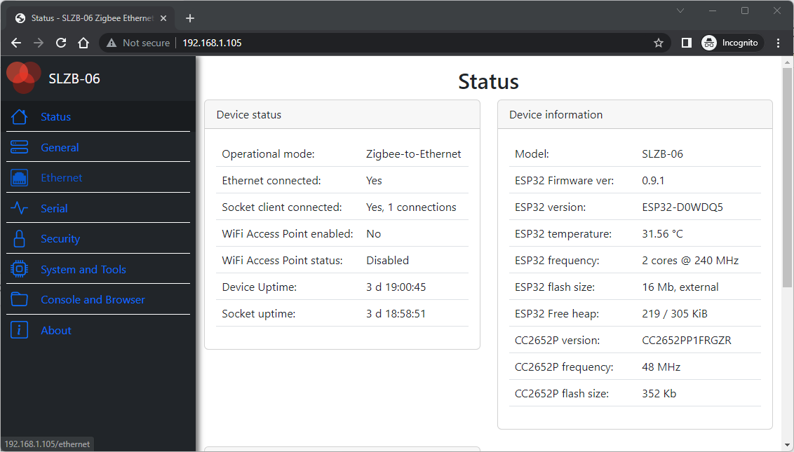
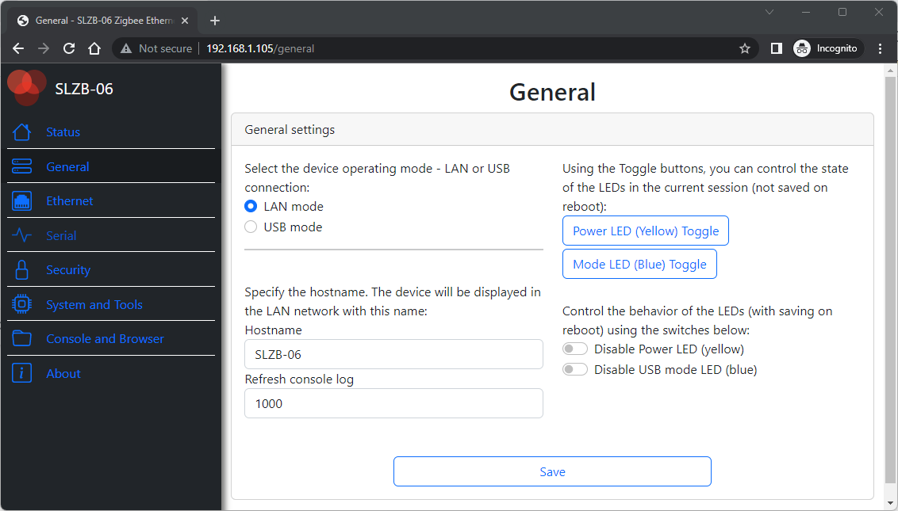
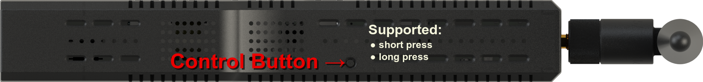

# Configuration

The SLZB-06 adapter can be configured either via a physical button or via the web interface.

## Configuring with Web-interface
To configure the operation via the web interface, connect the device to your LAN network and enter the IP address of the device in the browser of your laptop or phone. 
Main parameters of the web interface:
- **"Home"**: the current status of the device; no settings are available.

- **"General"**. Setting the device operation mode, LED operation mode, hostname and other general parameters.

- **"Ethernet"** - Ezernet settings (DHCP, IP address, etc.)
- **"Serial"**. Setting up access via Serial interface.
- **"Security"**. Setting security parameters, such as login, disabling the web interface.
- **"System and Tools**. General system features such as over-the-air updates, rebooting ESP32 and CC2652P.

- **"Console and Browser"**
- **"About"**

## Configuring with Button
Using the physical button, the following settings are possible:
1. Changing the device operating mode from Zigbee-to-Ethernet to Zigbee-to-USB and vice versa. The operating mode of the device is changed by short pressing the button.
2. Controlling the behaviour of LEDs. Long press - turns off the LEDs. Another long press - switches the LEDs to the default operating mode. 
   

::: tip
Button controls LED with rebooting. You can toggle LEDs without rebooting via web-interface (see System and Tools)
:::