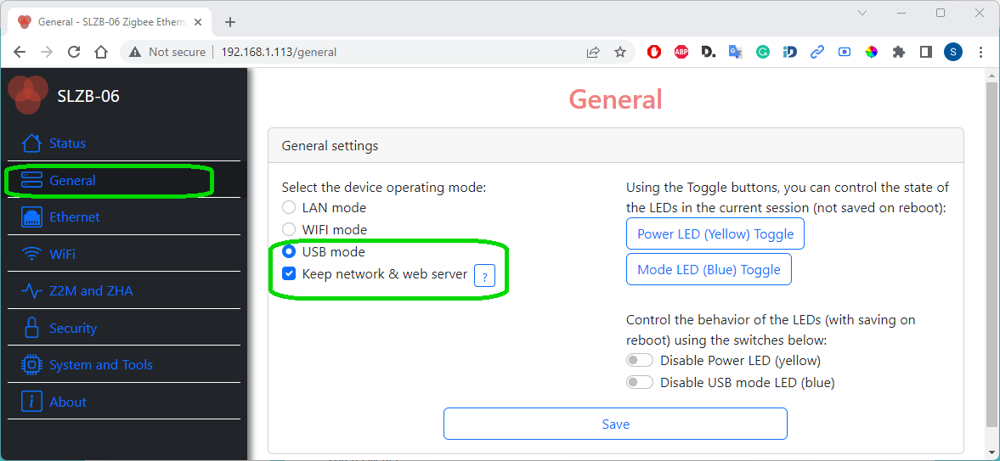
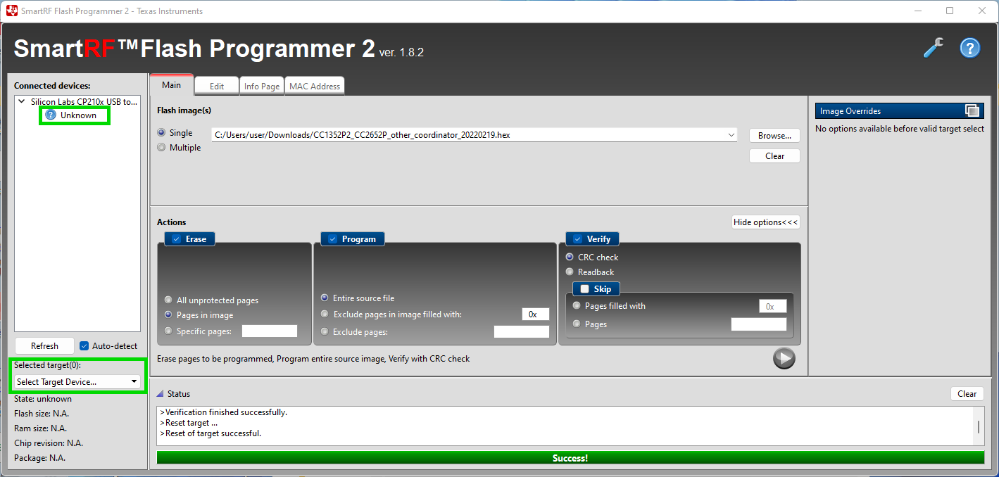
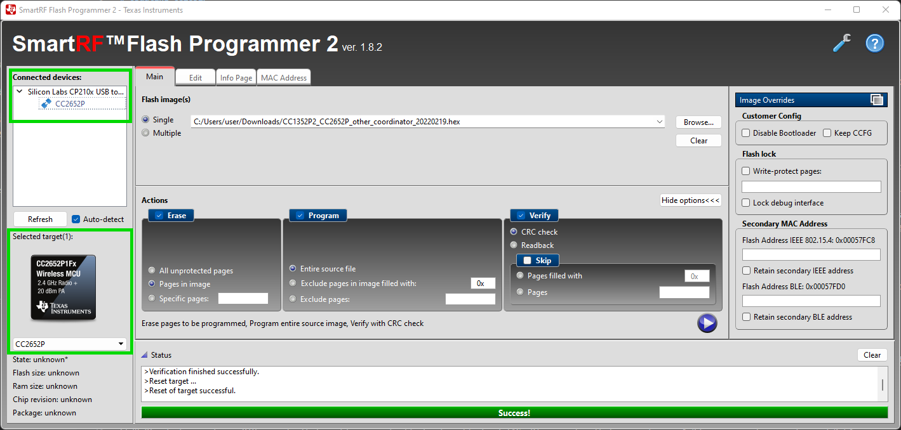
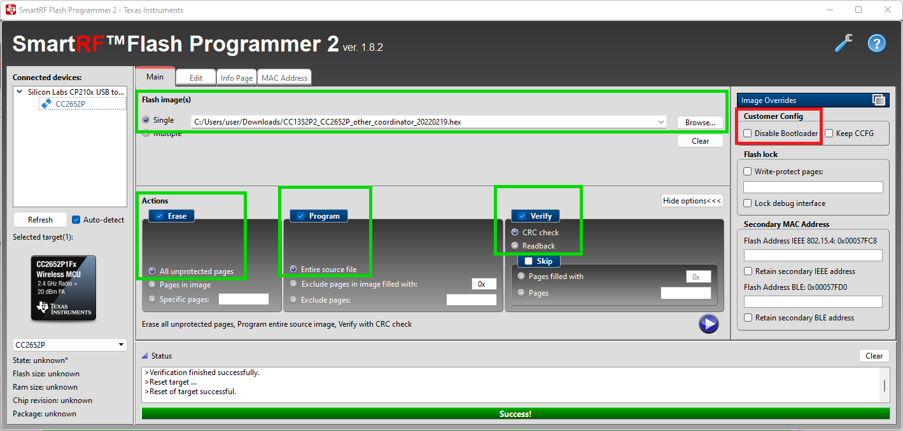
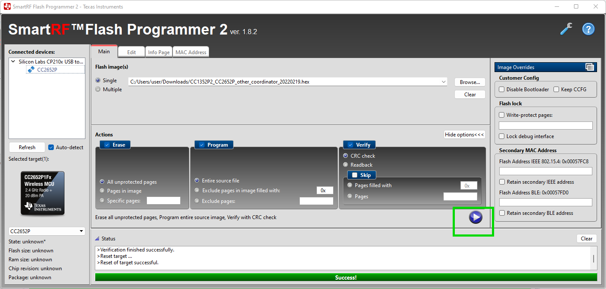
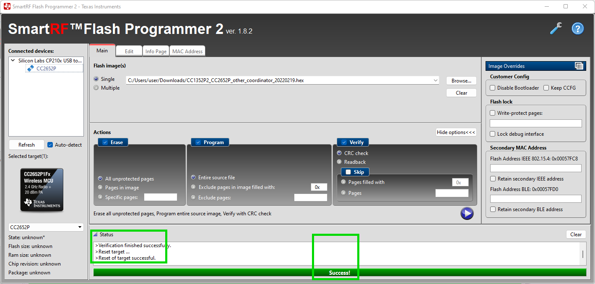
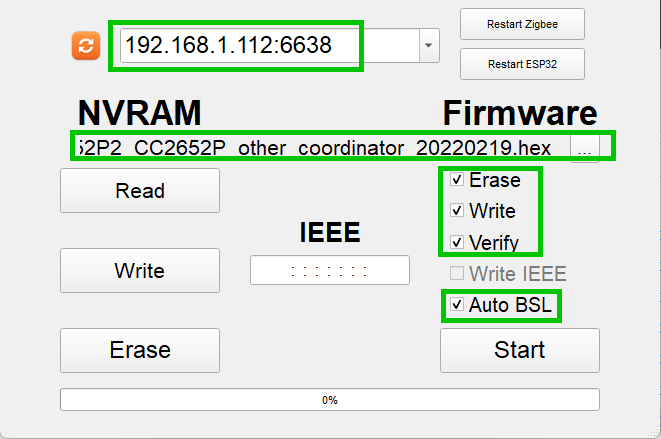
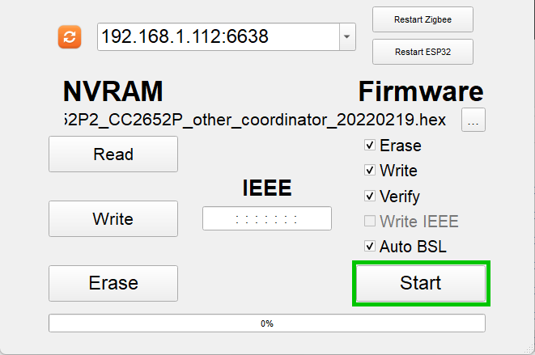
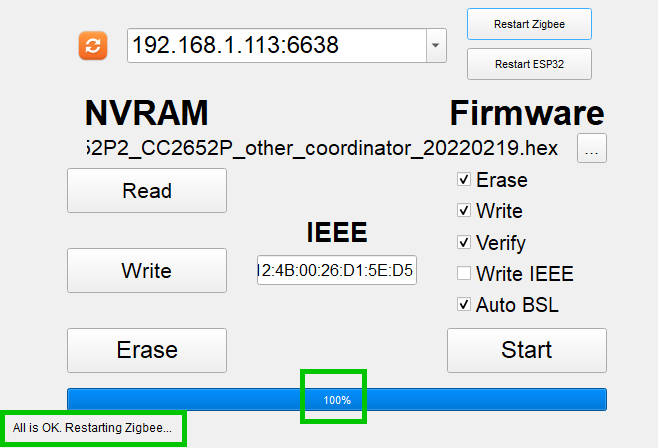

# Updating Zigbee CC2652P Chip
User can flash Zigbee SoC (which is Texas Instruments CC2562P) any of the tools described at [Zigbee2MQTT official web page here:](https://www.zigbee2mqtt.io/guide/adapters/#flashing-cc1352-cc2652-cc2538-based-adapters).  
There are several options for updates:
- Update over web-interface (recommended)
- Over-the-USB update
- Manual Over-the-Air (Ethernet) update
- Update with HW flasher
Below you can find detail manuals for few flashing options from those link.

## Zigbee auto update over the web-interface (recommended)  
::: tip
Update over web-interface can be done distantly without a physical access to your device!
:::  

::: warning
While updating Zigbee CC2652P via web-interface, SLZB-06 has to have access to the internet to check for the latest Zigbee firmware and be able to download it!
:::  

::: tip
Auto updated over web interface is available with the ESP32 firmware version 1.0.0-dev and later. Please refer for the [ESP32 firmware updates here](https://smlight.tech/manual/slzb-06/guide/flashing-and-updating/updating-esp32.html#updating-esp32-through-the-browser).  
:::  

1. Go to the SLZB-06's web interface.
2. Go to "System and Tools" -> tab "System tools" -> "Zigbee OTA Update" -> "Check for updates".
3. Choose available firmware and press "Flash...". Wait till untill message "Zigbee OTA update done" appear.  
        

Process video manual could be checked here (stat at 01:00m) [Youtube SLZB-06 video review](https://youtu.be/ps-x_-CQXp0?t=60).  
   

## Over-the-USB update

::: tip
Texas Instruments is a manufacturer of Zigbee SoC CC2652P which is used in SLZB-06 adapter. The most "true" method is to use official flasher although it is more complicated process.
:::

1. Download latest Zigbee firmware. SLZB-06 Adapter is based on CC2652P from Texas Instruments. Firmwares are based on Z-Stack. You can see the best one here [Koenkk Z-Stack firmware on Github](https://github.com/Koenkk/Z-Stack-firmware/tree/master/coordinator/Z-Stack_3.x.0/bin). Use frmware with a tag **"...other_coordinator_"**;
2. Download official Texas Instruments [Flash Programmer 2](https://www.ti.com/tool/FLASH-PROGRAMMER);
3. Install Flash Programmer 2;
4. Connect your SLZB-06 to your network and USB port;
5. Be sure, that your PC has USB drivers and SLZB-06 USB is recognized. If no, please install either [CP2102 driver](https://www.silabs.com/developers/usb-to-uart-bridge-vcp-drivers?tab=downloads) or [CH9102 driver](http://www.wch-ic.com/search?t=all&q=ch9102) depending you your hardware;
6. Change your SLZB-06 mode to Zigbee-to-USB with active `Keep network & web server` at the `General` tab of the web-interface;       
7. At SLZB-06 web-interface, go to the `System and Tools`, press button `Zigbee Flash Mode`;  
8. Open your Flash Programmer 2 from step 3. At the left window `Connected devices` click on `Unknown` and below at `Selected target` choose `CC2652P`;        You have to get the following:        
9. Do the following settings:
- Select firmware file under the Flash images(s) with the option `Single`;
- Make activer checkboxes `Erase` (All unprotected pages), `Program` (Entire source file), `Verify` (CRC check)
- Please very very careful, the `Disable bootloader` should remain **UNCHECKED**. Otherwise you will not be able to flash CC2652P via USB or LAN but just with external programmer;   You have to get the following:   

::: warning
Zigbee connectivity (e.g. Zigbee2MQTT or ZHA) should be disconnected. Flashing is impossible when the adapter is in *active* state.
:::  

10. Press the `Start` button (with Triangular) to Start the flashing;   You have to get the following:       
11. Wait until the message `Success!` is apeared at the progressbar and Status window states `Reset of target successful`. Flashing takes about 3 seconds;   You have to get the following:       
12. That is it. Flashing is done. You can use your device now with the new Zigbee firmware.  
    

## Manual Over-the-Air (Ethernet) update  
::: warning
Although this method allow to flash Zigbee remotely, we do not reccomend to use it as it requires very stable Ethernet connection between PC and SLZB-06! Use CC2652P web update feature instead - it downloads firmware to the SLZB-06 first and only after that starts flashing
:::  
::: tip
Update over Ethernet can be done distantly without a physical access to your device!
:::
1. Download latest Zigbee firmware. SLZB-06 Adapter is based on CC2652P from Texas Instruments. Firmwares are based on Z-Stack. You can see the best one here [Koenkk Z-Stack firmware on Github](https://github.com/Koenkk/Z-Stack-firmware/tree/master/coordinator/Z-Stack_3.x.0/bin). Use frmware with a tag **"...other_coordinator_"**;
2. Download [flashing tool](https://github.com/smlight-dev/ZigStarGW-MT/releases/tag/v0.3.5) - choose the right version for your OS;
3. Connect your SLZB-06 and PC with flashing firmware to the same LAN network over ethernet (cable) connection. It is important, as becouse WiFi can have some delays - it is incompatible for flashing. Flashing should be done only through ethernet connection;
4. Open Flashing tool and make te following settings:
- put IP address and port of your SLZB-06 to the respective field in the format `192.168.1.113:6638` where **192.168.1.113** is an IP address and **6638** - port;
- click buttn `...` and select your Zigbee firmware, downloaded at stage 1;
- Put active checkboxes `Erase`, `Write`, `Verify`, and `Auto BSL`;        
::: warning
Zigbee connectivity (e.g. Zigbee2MQTT or ZHA) should be disconnected. Flashing is impossible when the adapter is in *active* state.
:::  

5. Press `Start` button;    
6. Wait untill the process is completed: the progress bar contains the message **"100%"** and below text **All is Ok. Restarting Zigbee**. Flashing takes about 8 minutes;        
7. That is it. Flashing is done. You can use your device now with the new Zigbee firmware.  
   

## Update with HW flasher
SLZB-06 adapter contains DIY pinouts that enable users to flashe directly by J-TAG. Please note, that pin-outs are 1.27mm size, not commonly used 2.54mm size. 

