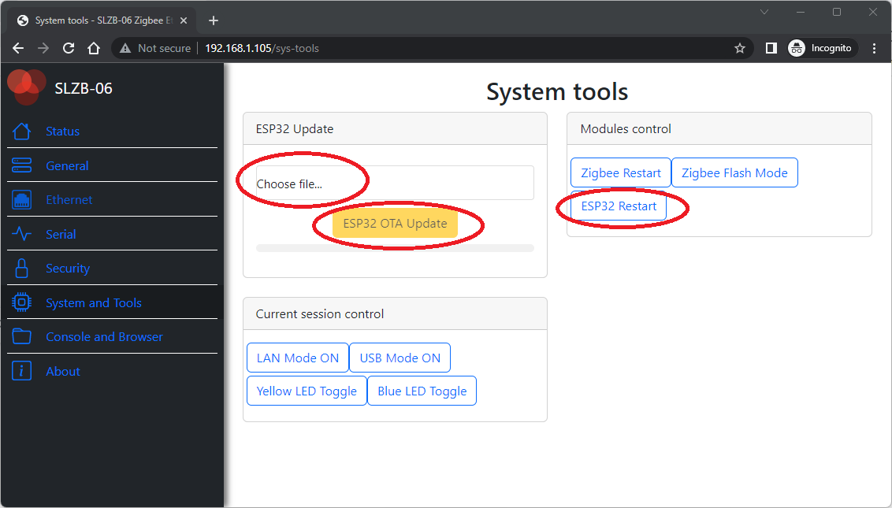

# Updating ESP32

## Updating ESP32 through the browser
::: tip
Update to the version 1.0.0-dev could be done only by web-flasher. If you change firmware before 1.0.0-dev (e.g. from 0.9.8 to 0.9.9) or after 1.0.0-dev (e.g. from 1.0.0-dev to 1.0.1-dev) you can use update remotely over web-innterface. For 1.0.0-dev - only via web-flasher!
:::  

1. Connect your SLZB-06 to the PC.
2. Follow his link [UPDATE FIRMWARE ONLINE](https://smlight.tech/manual/slzb-06/flasher/) and press "**Update firmware**" button at that page.  
::: warning
Please use Type-A [Connection to the PC] to Type-C [connection to SLZB-06] cable only. Flashing will not work with Type-C to Type-C cables.
:::  

## Updating ESP32 Over the Air (remotely)

If your SLZB-06 device has a LAN connection, you can update the ESP32 firmware remotely via Over-the-Air (OTA) updates feature. To update the firmware via OTA, follow these steps:
1. Download the latest firmware from [official SLZB-06 Firmware repository](https://github.com/smlight-dev/slzb-06-firmware/);
2. Go to the web interface of the device;
3. Go to the System and Tools section. In the "ESP32 Update" card 
- click Choose file;
- select the firmware (*.bin file) and
- Click ESP32 OTA Update.

4. Wait for the firmware to finish and reboot the device.  

## Updating ESP32 via USB
If your SLZB-06 device is not connected to LAN or you want to flash ESP32 via USB for other reasons, it can be easily done via USB cable. For this purposes you need:
- A computer with Windows or Mac installed;
- USB - Type-C cable.

To flash via USB, follow these steps:
1. Download the flashing software. We recommend using ESP_Flasher, which can be downloaded from [this fork of official repository at Github](https://github.com/smlight-dev/ESP_Flasher);
2. Download the latest firmware version from [official SLZB-06 Firmware repository](https://github.com/smlight-dev/slzb-06-firmware/);
3. Using USB cable, connect SLZB-06 to your computer;
4. Be sure, that you have downloaded and installed the drivers for USB/UART converter, built in to your SLZB-06.
- for CP2102 USB/UART converter please use the latest version from the [official web-page here](https://www.silabs.com/interface/usb-bridges/classic/device.cp2102?tab=softwareandtools);
- for СH9102 USB/UART converter please use the latest version from the [official web-page here](http://www.wch-ic.com/search?q=CH9102&t=downloads);
4. Run the ESP_Flasher program and
- Select Serial-port in the Serial port section;
- In the Firmware section, select the file with your firmware;
- Press the "Flash ESP" button.
5. Wait for the firmware to complete.

## Updating ESP32 via DIY pinouts
