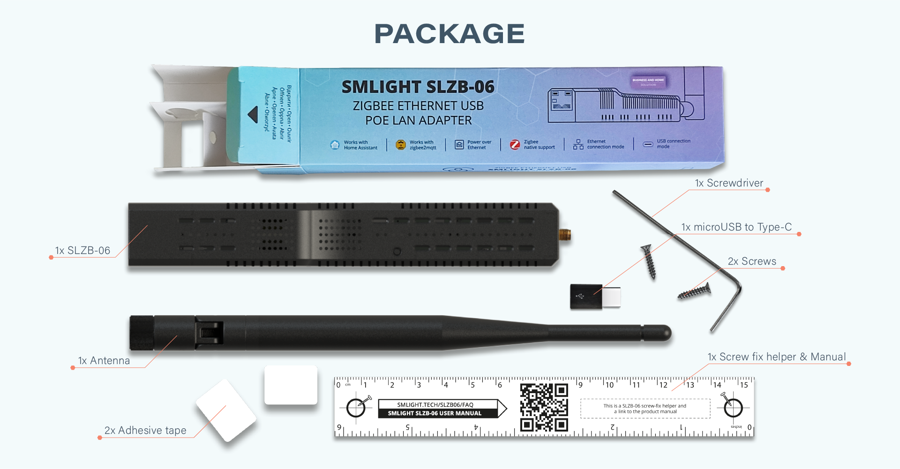
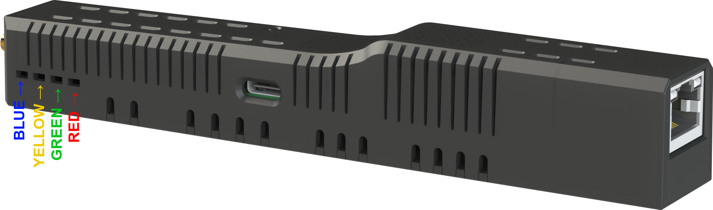
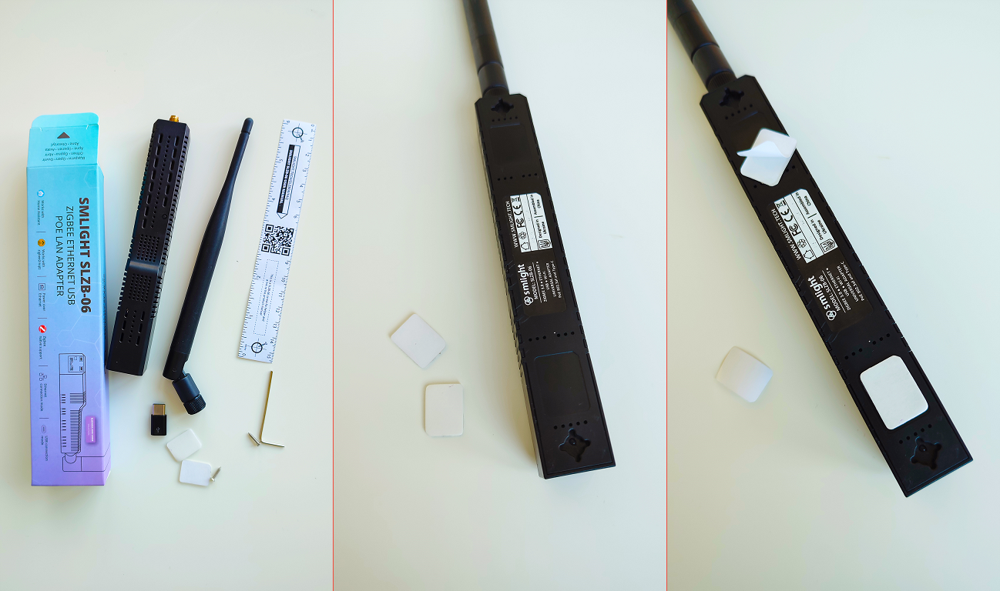
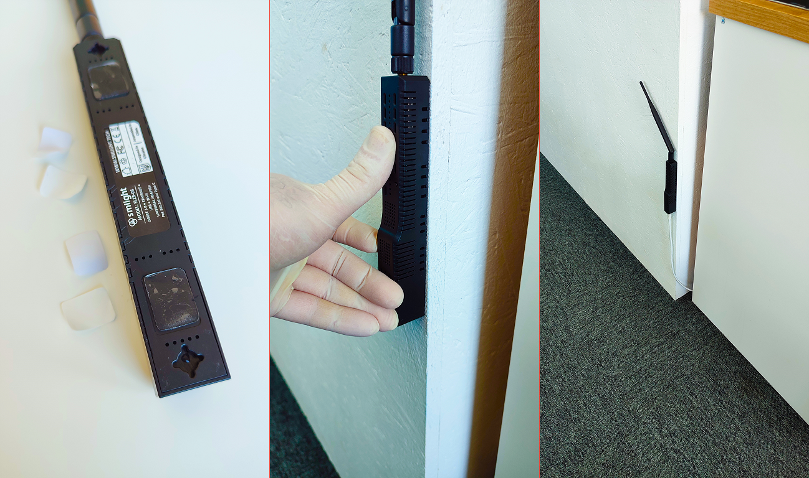
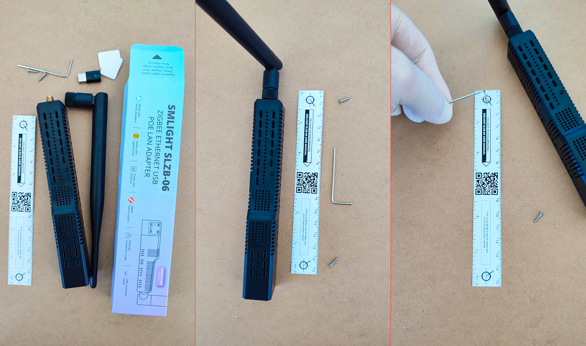
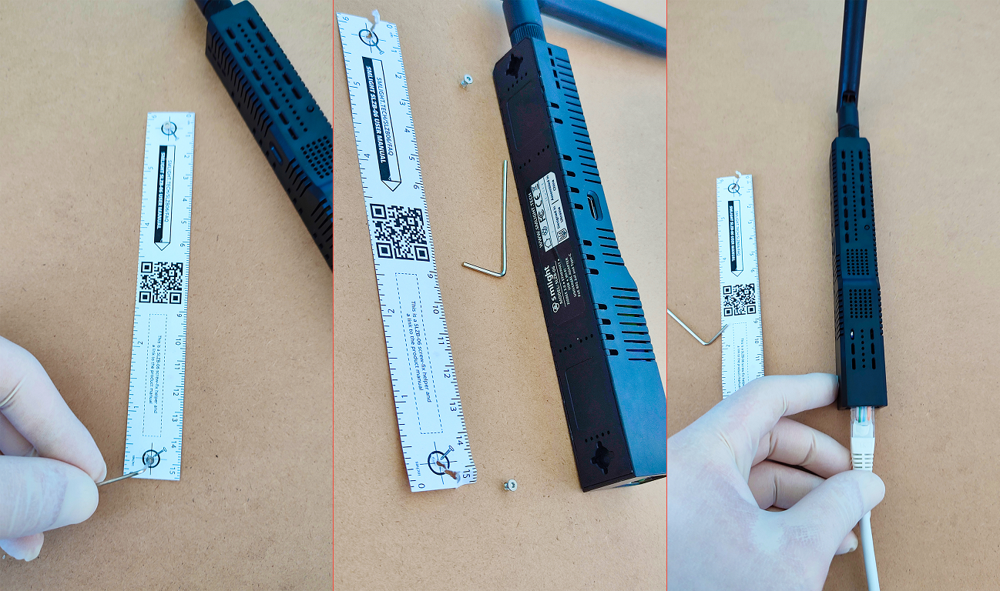

# Getting started

## About

SLZB-06 is Zigbee adapter, that enables Zigbee packet forwarding over Ethernet, WiFi or Serial (USB) connection, and serves as an access point in a Zigbee network. Zigbee adapter allows you to connect devices from different producers (Tuya, IKEA, Xiaomi, Gledopto, Moes, Sonoff and others) into one system. In order to properly use SLZB-06 you need to have an instance of [Home Assistant](https://www.home-assistant.io/installation/) and [zigbee2mqtt](https://www.zigbee2mqtt.io/guide/installation/).

### What is in the box?
- 1x SLZB-06 Zigbee Ethernet PoE USB WiFi Adapter
- 1x 5dB Antenna
- 1x microUSB-to-typeC adapter (just in case you want to use as USB but do not have type-C cable)
- 2x adhesive tapes - if you want to stock you adapter - easiest way to do that
- 2x screws - if you want to fix your adapter by screws - easey, they are included
- 1x screwdriver - you will use it to fix by screws;
- 1x screw-helper and QR-manual - even more easy screw fixing and link to this manual;
  

## Powering the device
Device can be powered by either PoE through Ethernet cable or by type-C plug.

::: tip
Package contains microUSB-typeC adapter. If you want to power on your device by type-C but do not have type-C cable, use microUSB-typeC adapter.
:::

::: tip
SLZB-06 has optoelectronic isolation, so can be connected to USB port of your PC and at the same time to Ethernet/PoE cable!
:::

## LED behaviour
- **Yellow** LED is the power LED. Default operation: On when the unit is connected to a power source.
- **Blue** LED is the operation mode LED. Default operation: On when the device is in Zigbee-to-USB mode and off when the device is in Zigbee-to-Ethernet mode.
- **Green** LED - Zigbee2MQTT connection LED. Default operation: On when Zigbee2MQTT has successfully connected to the device and Zigbee network is established. 
- **Red** LED - reserved for further work with Zigbee2MQTT
  

## Stick to wall

SLZB-06 adapter can be attached to the wall, or anything else you want, with either double-sided adhesive tape or screws. Both are included in the package.  
See the 6-step graphic instructions below for attaching the SLZB-06 adapter to double-sided adhesive tape and screws.

### Adhesive tape

### Screws

   

::: tip
Screwdriver included in the package
:::