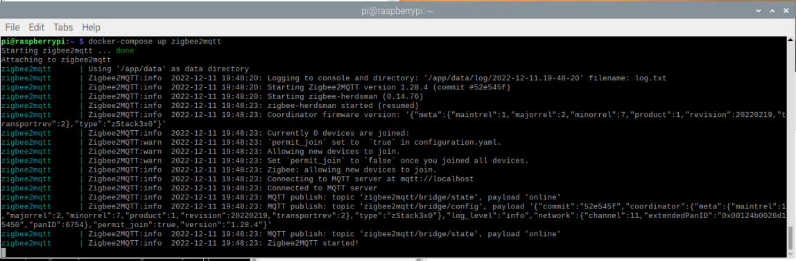

---
---

# Installation

You can use SLZB-06 either as Zigbee to Ethernet adapter or as Zigbee to USB adapter. Depending on the type you are going to use, you can connect you device.

## Zigbee2MQTT setup

### Connection over Ethernet

1. Plug in RJ45 cable to your device. 
::: tip
SLZB-06 has optoelectronic isolation, so can be connected to USB port of your PC and at the same time to Ethernet/PoE cable!
:::

2. Follow Zigbee2MQTT set-up process [official guideline](https://www.zigbee2mqtt.io/guide/configuration/adapter-settings.html). You can set-up as a linux package, docker container or extension for Home Assistant. 
3. Use the following lines in `port:` settings:
```yaml
...
serial:
  port: tcp://192.168.0.105:6638
...
```
where 
- `192.168.0.105` is an IP address of SLZB-06 in your network;
- `6638` is a port of your SLZB-06 adapter (default is **6638**, can be configured within Firmware);
4. Run Zigbee2MQTT.  


### Connection over USB

1. Plug in type-C cable to the device.
::: tip
SLZB-06 has optoelectronic isolation, so can be connected to USB port of your PC and at the same time to Ethernet/PoE cable!
:::  

::: warning
Please use Type-A [Connection to the PC] to Type-C [connection to SLZB-06] cable only. Data transimmison will not work with Type-C to Type-C cables.
:::  

::: warning
**DRIVERS for USB/UART converter**! SLZB-06 uses CP2102 as an USB/UART chip. If your system does not recognize the device, you have to install the drivers. We reccomend to use the drivers from [official web page of Silicon Labs CP210x driver page](https://www.silabs.com/developers/usb-to-uart-bridge-vcp-drivers?tab=downloads)!
:::

2. Follow Zigbee2MQTT set-up [official guideline](https://www.zigbee2mqtt.io/guide/configuration/adapter-settings.html). You can set-up as a linux package, docker container or extension for Home Assistant. 
3. Use the following lines in `port:` settings:
```yaml
...
serial:
  port: /dev/ttyUSB0
...
```
where 
- `/dev/ttyUSB0` is an ID of SLZB-06 device within your system;

### Running Z2M in a Docker
Sample `docker-compose` settings that were tested sucesfully:
```yaml
version: '3'
services:
  zigbee2mqtt:
    container_name: zigbee2mqtt
    image: koenkk/zigbee2mqtt
    restart: unless-stopped
    network_mode: host
    privileged: true
    environment:
      - TZ=Europe/Kiev
    volumes:
      - /run/udev:/run/udev:ro
      - /home/pi/docker-containers/zigbee2mqtt:/app/data
```
.  

Key parameters and their definitions:
- `network_mode: host` - means that your containers has the same access as the host machine. 
- `privileged: true` - allows your container to access your host devices, important if you are using a USB connection.
- `/home/pi/docker-containers/zigbee2mqtt` is a location of your Zigbee2MQTT configuration.yaml file.

## ZHA (Zigbee Home Automation) setup
### Autodiscovery
Home Assistant version 2023.1 and above contains LAN autodiscovery feature for SLZB-06. If mDNS is allowed by your network router, the set-up is stightforward:
1. Run your Home Assistant
2. Plug-in your SLZB-06 to LAN (either by Ethernet or WiFi).
3. Home Assistant will makes notification that new supported device is found and will propose to set it up. Confirm it and that is it - SLZB-06 is inegrated into your Home Assistant throught ZHA integration.

### Manual set-up
1. Go to Home Assistant
2. Click `Settings`
3. Go to `Devices & Services`
4. Click `Add integration` (right bottom corner)
5. Find «Zigbee Home Automation», click on it;
6. Between two options «Add Zigbee device» and «Zigbee Home Automation» choose `Zigbee Home Automation`;
7. Select serial port window - `Enter manually`
8. Radio type window - `ZNP = Texas Instruments Z-Stack ZNP … `
9. Serial port settings window:
- Serial device path: « socket://192.168.1.105:6638 », where 192.168.1.105 is IP address of your SLZB-06;
- port speed left by default 115200;
- data flow control undefined (it does not matter for LAN adapters)
10. Press `Submit`.
11. Network formation window - `Erase network settings and form a new network`
12. Wait for Zigbee network and try to add some Zigbee end-device (e.g. sensor etc)
