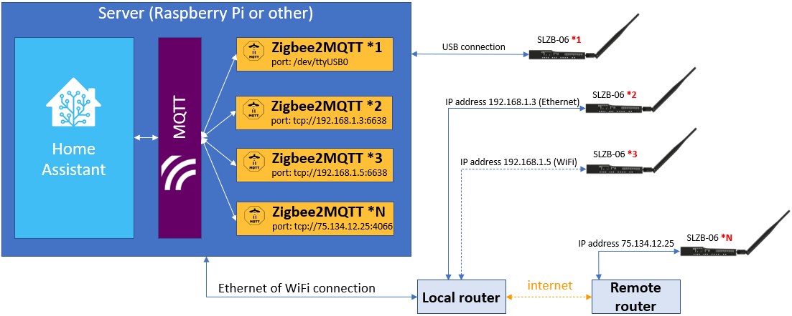

# Multiple adapters setup
Sometimes the system architecture requires to manage several SLZB-06 Zigbee cordinators under the same instance of Home Assistant. Such cases include but not limited:
- cover remote locations in you apartment, or different floor of basement etc;
- cover remote building like garage etc via LAN connection;
- cover remote location like summer house via Internet remote;
- if you have "unstable" end-devices and want to segregate them from the main Zigbee network;
- if you want to have a "guest" Zigbee network for testing and DIY works.

It is possible to connect any number of SLZB-06 coordinators to the same Home Assistant instance. 
The coordinators can function simultaneously, regardless of whether they are:
- connected via a USB cable;
- connected via Ethernet or WiFi on a local network (either with a PoE power supply or a type-C power supply);
- connected via Ethernet or WiFi on a remote network over an Internet connection (either with a PoE power supply or a type-C power supply).
Possible connection scenarios and the architecture of the multi-coordinator system are shown in the figure below.

  
The number of SLZB-06 Coordinators is not limited, you can link as many of them as you need.  

:::  tip
Each coordinator creates a separate Zigbee network. This does not typically matter to the end-users, as Home Assistant does not care which coordinator the end devices are connected to. The only case when it might matter is when using direct binding — the bound devices have to be connected to the same network.
:::

In order to run several coordinators you have to:
- install and run several instances of Zigbee2MQTT on your server;
- configure each Zigbee2MQTT instance according to your adapter settings, e.g. add their IP addresses to the following section of Zigbee2MQTT config:
```yaml
...
data_path: /config/zigbee2mqtt_1
...
mqtt:
  base_topic: zigbee2mqtt_1
...
serial:
  port: tcp://192.168.0.105:6638
...
advanced:
  pan_id: 6754
  chanel: 11
...
```
The example value meanings are as explained below.
- `/config/zigbee2mqtt_1` - set up unique path to each Zigbee2MQTT instance, e.g. use `/config/zigbee2mqtt_1` for Zigbee2MQTT instance #1, `/config/zigbee2mqtt_2` for Zigbee2MQTT instance #2 etc;
- `mqtt:   base_topic: zigbee2mqtt_1` - unique MQTT topic for each Zigbee2MQTT instance, e.g. `base_topic: zigbee2mqtt_1` for Zigbee2MQTT instance #1, `base_topic: zigbee2mqtt_2` for Zigbee2MQTT instance #2 etc;
- `192.168.0.105` is an IP address of SLZB-06 on your network;
- `6638` is a network port your SLZB-06 adapter uses (the default is **6638**, it can be changed within Firmware);
- `pan_id: 6754` - a unique PAN ID (ID of the Zigbee network) for each Zigbee2MQTT instance, e.g. use `6754` for Zigbee2MQTT instance #1, `1234` for Zigbee2MQTT instance #2 etc; `pan_id` can be ANY 4 digits
- `chanel: 11` - a Zigbee network channel. Similar to WiFi networks, each network operates on its own channel. It is possible for several Zigbee networks to use the same channel, however it is recommended to use different ones. Please use dedicated channels for different devices to reduce interference.
Please follow the [official Zigbee2MQTT](https://www.zigbee2mqtt.io/guide/configuration/zigbee-network.html#network-config) guide for additional explanation of the config settings.

:::  warning
If you are going to use a remote SLZB-06 Zigbee coordinator with access over Internet, we reccomend securing your connection to the remote device by in any available way.
:::

:::  warning
chapter to be added
:::
